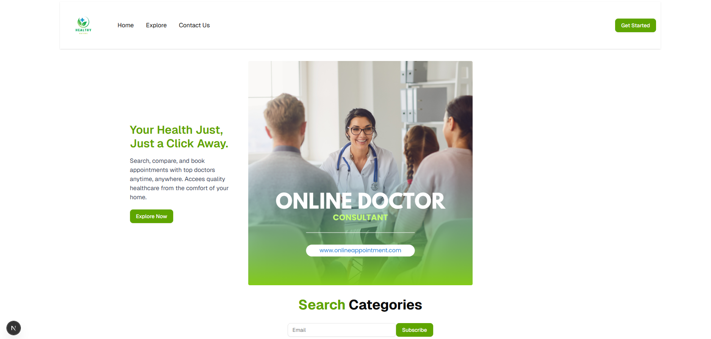
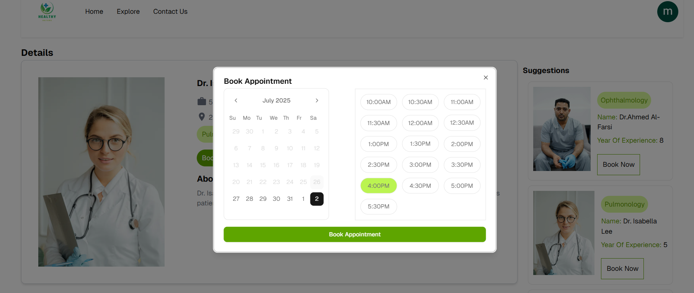
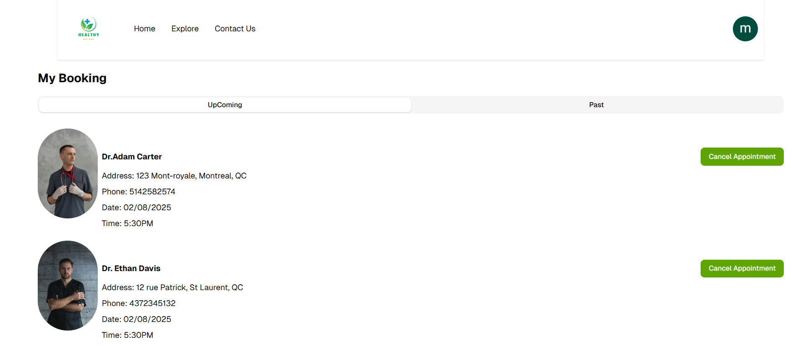

## Pages principales

- **Page d’accueil** 

  Présentation générale avec une liste de suggestions de docteurs, recherche par catégories, etc.

- **Page Liste des docteurs** 
  Affiche tous les docteurs disponibles avec leurs détails essentiels.

- **Page Détail docteur** 
  Affiche les informations détaillées d’un docteur, avec bouton pour prendre rendez-vous.

- **Page Prise de rendez-vous**   
  Formulaire pour réserver un rendez-vous, accessible uniquement aux utilisateurs authentifiés.

- **List Des RDV**   
  cette page permet aux utilisateurs de consulter tous leurs rendez-vous planifiés avec les médecins, incluant la date, l'heure et les détails du docteur.

- **Catégories de docteurs**   
  cette page présente différentes spécialités médicales (cardiologie, dermatologie, etc.). Elle permet à l’utilisateur de filtrer les docteurs en fonction de leur domaine de spécialisation pour prendre un rendez-vous ciblé.

---

## Composants principaux utilisés

- **Shadcn UI**  
  Pour les composants UI comme boutons, alertes, modales, tabs, etc.  
  _(ex : `AlertDialog`, `Tabs`, `Button`, etc.)_

- **Kinde Auth**  
  Pour la gestion sécurisée de l’authentification (connexion, déconnexion, sessions).

- **Tailwind CSS**  
  Pour le styling rapide, responsive et moderne.

- **Next.js**

## Fonctionnalités principales

- **Navigation intuitive** entre les pages : accueil, liste des docteurs, détails, prise de rendez-vous, etc.

- **Recherche de docteurs** par nom ou par spécialité médicale.

- **Authentification sécurisée avec Kinde** : seuls les utilisateurs authentifiés peuvent réserver un rendez-vous.

- **Prise de rendez-vous en ligne** avec sélection de date et d’heure.

- **Consultation des rendez-vous planifiés** dans une interface claire.

- **Annulation d’un rendez-vous** par l’utilisateur, si nécessaire.

- **Affichage des rendez-vous à venir** ainsi que des rendez-vous passés.

- **Filtrage des docteurs par catégorie/spécialité** (cardiologue, dermatologue, etc.).

- **Interface responsive** adaptée aux mobiles, tablettes et ordinateurs.

### 🔜 Fonctionnalités à venir (Roadmap)

- [ ] Système de notifications (email/SMS) pour rappeler les rendez-vous.
- [ ] Intégration d’un calendrier global pour une meilleure visualisation.
- [ ] Système de notation/commentaire pour chaque docteur.
- [ ] Tableau de bord admin (gestion des docteurs, utilisateurs, RDV).
- [ ] Traduction multilingue (français/anglais).
- [ ] Mode sombre.
"# doctor-appointment-frontend"  git init git add README.md
"# doctor-appointment-frontend" 
